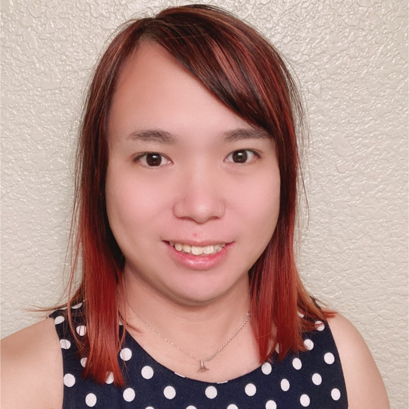

# Contact Information

email: wjmiao (at) ucdavis (dot) edu\
ORCID: [0000-0002-7511-0269](https://orcid.org/0000-0002-7511-0269) \
Linkedin: [here](https://www.linkedin.com/in/dolores-miao-82b4a061/)
CV: [here](miao_CV_resume.pdf) \
Last updated: August 23rd, 2024

Welcome to Dolores Miao's homepage! You can find my professional and academic work here.

# Short Biography

Dolores Miao is a Computer Science PhD student at UC Davis, at the Programming Languages and Software Engineering lab led by [Prof. Cindy Rubio-González](https://web.cs.ucdavis.edu/~rubio/). Her research areas are correctness on numerical programs involving floating-point arithmetics, and performance optimization of parallel programs. Prior to that, she was awarded a BEng degree in Communication Science and Engineering at Fudan University in 2007.

She is also a veteran lead software engineer in video game development, with 14 years of project experience, including project and team management. She is proficient in game development in various areas such as graphics/shader programming, network multiplayer protocols, game engine frameworks, performance engineering on run time and I/O, and debugging. She is the lead software engineer of video game **Final Fantasy XII The Zodiac Age**, which was nominated for "Best Remake/Remaster" at IGN's Best of 2017 Awards, and won "Best Remaster" at Game Informer's Best of 2017 Awards and 2017 RPG of the Year Awards.

Dolores Miao grew up in southern China, having lived her first 18 years in Guangdong Province, and her next 18 years in Shanghai. She is a transgender woman and has been in gender transition since 2019.

# Education Experience

## University of California, Davis (2020 – present)

Doctor of Philosophy, Computer Science\
_Davis, CA, USA_

## Fudan University (2003 - 2007)

Bachelor of Engineering, Communication Science and Engineering\
_Shanghai, China_

# Research and Teaching Experience

## Computing Graduate Student Intern - Lawrence Livermore National Laboratory (Summer 2023, 2022)

Worked on ongoing research projects about numerical correctness and performance optimizations.

## Teaching Assistants

ECS 140A Programming Languages - University of California, Davis (Spring 2024, 2023)

## Co-reviewer

PLDI 2024, ICSE 2024, OOPSLA 2023, FSE 2022

# Publications

Miao, D., Laguna, I., Georgakoudis, G., Parasyris, K., & Rubio-González, C. (2024, August) \
**An Automated OpenMP Mutation Testing Framework for Performance Optimization** \
In Parallel Computing (PARCO), Volume 121 \
([PDF](https://doi.org/10.1016/j.parco.2024.103097), [Bibtex](parco121.bib))

Miao, D., Laguna, I., & Rubio-González, C. (2024, June) \
**Input Range Generation for Compiler-Induced Numerical Inconsistencies** \
In Proceedings of the 38th ACM International Conference on Supercomputing (ICS'24) \
([GitHub repository](https://github.com/LLNL/CIGEN), [PDF](ics24.pdf), [BibTex](ics24.bib))

Miao, D., Laguna, I., Georgakoudis, G., Parasyris, K., & Rubio-González, C. (2024, March) \
**MUPPET: Optimizing Performance in OpenMP via Mutation Testing** \
In Proceedings of the 15th International Workshop on Programming Models and Applications for Multicores and Manycores (PMAM'24) \
([PDF](pmam24.pdf), [BibTex](pmam24.bib))

Miao, D., Laguna, I., & Rubio-González, C. (2023, May) \
**Expression Isolation of Compiler-Induced Numerical Inconsistencies in Heterogeneous Code** \
In International Conference on High Performance Computing 2023 (ISC'23) \
(Hans Meuer Award for Best Research Paper) \
([GitHub repository](https://github.com/LLNL/Ciel), [PDF](isc23.pdf), [BibTex](isc23.bib))

# Industry Experience

## Various software engineering positions - [Virtuos Games](http://www.virtuosgames.com) (2007 – 2021)

Worked in following positions: 
* Software Engineer (2007-2011) 
* Lead Software Engineer (2011-2016) 
* Assistant Technical Director (2017-2021) 

Assistant Technical Director work summary:	
 
* Work with teams and technical director to make technical decisions w.r.t. project proposals and technical design documents for projects 
* Managing teams, tracking work progress and career growth of team members 
* Feasibility research, complex feature implementation, and fixing critical bugs 
* Taught Internal training courses: C#, Performance Engineering 

Notable projects: 
 
* [FINAL FANTASY X/X-2 HD Remaster (PS3, PSVita, PS4, PC)](https://finalfantasyxhd.square-enix-games.com/en-us/home/)

* [FINAL FANTASY XII THE ZODIAC AGE (PS4, Xbox one, Switch, PC)](https://finalfantasyxii.square-enix-games.com/home/?lang=us)

* [Bioshock: The Collection (Switch)](https://2k.com/en-US/game/bioshock-the-collection/)

* [XCOM 2 Collection (Switch)](https://store.2k.com/game/buy-xcom-2-collection)

* [Tales from the Borderlands (Switch)](https://borderlands.2k.com/tales-from-the-borderlands/)

# Skills

Natural languages: can speak and write in fluent English and Chinese (Mandarin and Cantonese, the latter of which is of native fluency)

Programming: 

Worked on projects using C, C++, C#, and Python programming languages.\
Experience using parallel programming paradigms including pthread, OpenCilk, OpenMP & CUDA.\
Knowledge about real-time rendering pipelines, 6 year experience in shader languages such as HLSL and GLSL.\
Compiler engineering experience using LLVM passes, ROSE and Clang source-to-source compiler plugins.
