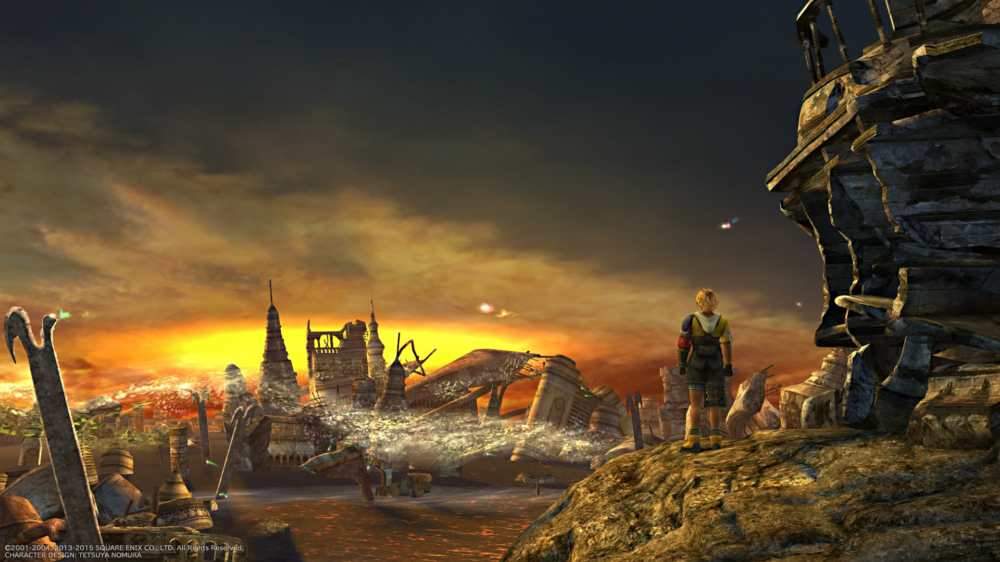

Welcome to Dolores Miao's homepage! You can find my professional and academic work here.

# Education Experience

## Doctor of Philosophy - Computer Science - University of California, Davis (2020 – present)

GPA: 4.0

Work as Graduate Student Researcher in the Programming Languages and Software Engineering lab, under supervision by [Prof. Cindy Rubio-González](https://web.cs.ucdavis.edu/~rubio/).

* Research on software optimization. Reduce the time and memory usage when running numerical programs.  
* Research on testing methods for numerical software correctness. 

Published work:

Expression Isolation of Compiler-Induced Numerical Inconsistencies in Heterogeneous Code, D. Miao, I. Laguna, and C. Rubio-González. To appear in Proceedings of ISC High Performance (ISC'23), Hamburg, Germany, May 2023. (doi/repo link to be added)

Another two papers are currently work in progress.

## Bachelor of Engineering - Communication Science and Engineering - Fudan University (2003 -2007)

GPA: 3.21

# Work experience

## Computing Graduate Student Intern - Lawrence Livermore National Laboratory (Summer 2022)

Worked on ongoing research projects about numerical correctness in scientific computing.

## Various software engineering positions - [Virtuos Games](www.virtuosgames.com) (2007 – 2021)

Worked in following positions: 
* Software Engineer (2007-2011) 
* Lead Software Engineer (2011-2016) 
* Assistant Technical Director (2017-2021) 

Assistant Technical Director work summary:	
 
* Work with teams and technical director to make technical decisions w.r.t. projectsroposals and technical design documents for projects 
* Managing teams, tracking work progress and career growth of team members 
* Feasibility research, complex feature implementation, and fixing critical bugs 
* Taught Internal training courses: C#, Performance Engineering 

Notable projects: 
 
* FINAL FANTASY X/X-2 HD Remaster (PS3, PSVita, PS4, PC)

* FINAL FANTASY XII THE ZODIAC AGE (PS4, Xbox one, Switch, PC)

* Bioshock: The Collection (Switch) 

* XCOM 2 Collection (Switch) 

* Tales from the Borderlands (Switch) 

