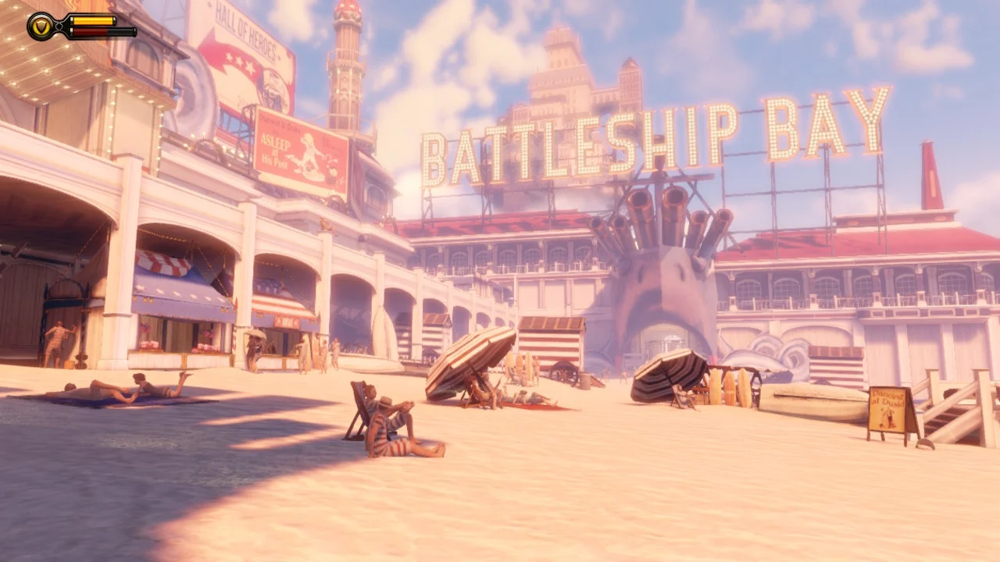
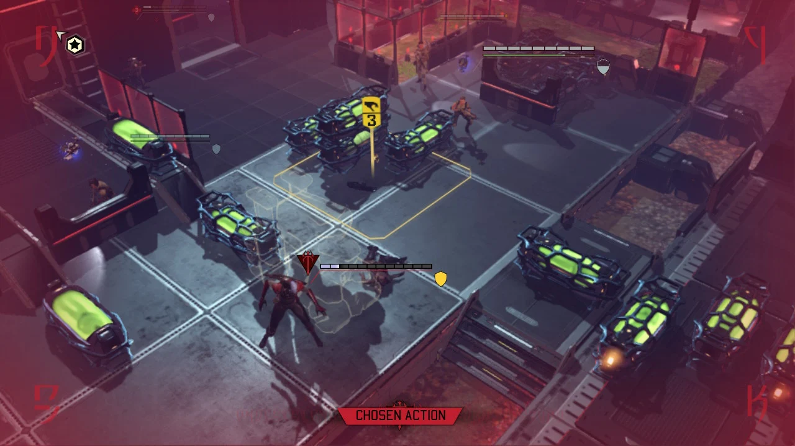

# Industry Experience

## Various software engineering positions - [Virtuos Games](http://www.virtuosgames.com) (2007 – 2021)

Worked in following positions: 
* Software Engineer (2007-2011) 
* Lead Software Engineer (2011-2016) 
* Assistant Technical Director (2017-2021) 

Assistant Technical Director work summary:	
 
* Work with teams and technical director to make technical decisions w.r.t. project proposals and technical design documents for projects 
* Managing teams, tracking work progress and career growth of team members 
* Feasibility research, complex feature implementation, and fixing critical bugs 
* Taught Internal training courses: C#, Performance Engineering 

Notable projects: 
 
* [FINAL FANTASY X/X-2 HD Remaster (PS3, PSVita, PS4, PC)](https://finalfantasyxhd.square-enix-games.com/en-us/home/)

* [FINAL FANTASY XII THE ZODIAC AGE (PS4, Xbox one, Switch, PC)](https://finalfantasyxii.square-enix-games.com/home/?lang=us)

* [Bioshock: The Collection (Switch)](https://2k.com/en-US/game/bioshock-the-collection/)

* [XCOM 2 Collection (Switch)](https://store.2k.com/game/buy-xcom-2-collection)

* [Tales from the Borderlands (Switch)](https://borderlands.2k.com/tales-from-the-borderlands/)

